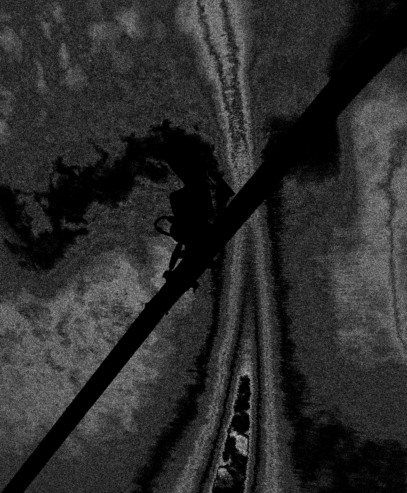

# Pic_utils
Set of curated Python tools used for image processing. Mainly with artistic purposes.

- [**Recommended usage**](#recommended-usage)
- [**Examples created with this software**](#examples-created-with-this-software)

## Recommended usage:

Clone or download this repository to explore and modify your own images using the provided tools. The focus of this collection is creative and artistic image processing, not machine learning preprocessing or technical data augmentation. (Feel free to experiment nonetheless)

You can combine and customize the utilities to create textures, filters, or generative visual effects. Please use this software responsibly and respect ethical and legal guidelines when working with digital imagery.

## Examples created with this software:

  
  
  
  

  

  

  

