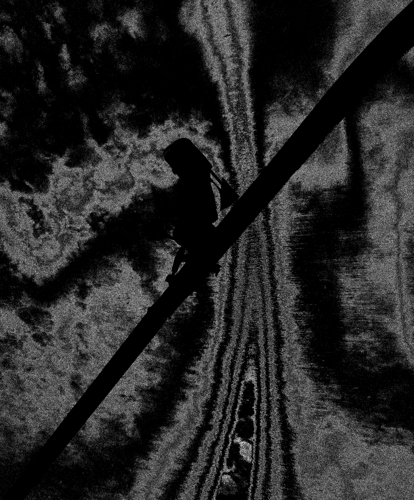

# Pic_utils
Set of curated Python tools used for image processing. Mainly with artistic purposes.

- [**Recommended usage**](#recommended-usage)
- [**Examples created with this software**](#examples-created-with-this-software)

## Recommended usage:

Download this code and use it to modify your ohitis with high detail. This set of tools was designed with the aim to produce artistic imagery, not to perform ML image preprocessing. For this reason, this set of tools allows the user to treat their image as a canvas and apply different digital processing techniques (Data Moshing, Compression, Digital Double Exposition and more).

## Examples created with this software:

  

  

  

  

  

